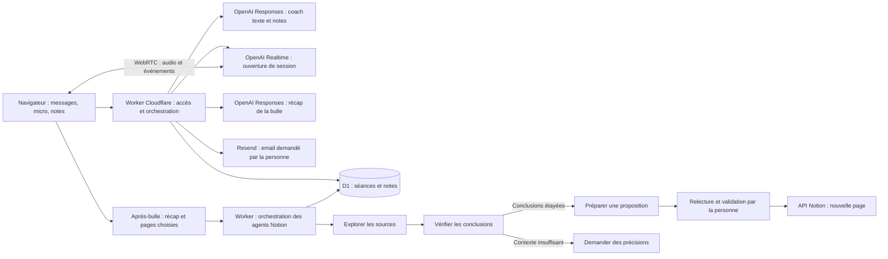

# Architecture de La Bulle et de l’après-bulle

Deux parcours se complètent : le coach accompagne la réflexion ; l’après-bulle en tire un récap
modifiable et peut le prolonger par une proposition dans Notion. La connexion Notion est
facultative.

## Les composants

Le frontend est en HTML/CSS/JavaScript, sans framework. Un Worker TypeScript sert l’API et les
fichiers statiques. Le secret OpenAI reste dans le Worker. Le navigateur échange son offre SDP
contre une réponse SDP via le serveur, puis communique directement avec Realtime.

## La logique d’agent

Pour chaque message, le serveur retrouve le fil et les notes approuvées. Le LLM choisit une
intention de conversation (clarifier, reformuler, explorer ou clôturer) et formule sa réponse dans
un schéma JSON vérifié. Le choix et la réponse sont enregistrés. Le contenu de la bulle suit les
questions originales du PDF ; le modèle identifie où en est l’échange et traite les demandes de
clarification ou d’arrêt.

En vocal, Realtime suit les 14 questions du protocole Kedo présentes dans ses instructions. La
détection native `semantic_vad` avec `eagerness: medium`, `create_response: true` et
`interrupt_response: true` gère entièrement la prise de parole. Les réponses ordinaires sont créées
côté OpenAI sans attendre la transcription. Le navigateur demande l’accueil, les phrases liées aux
pauses et l’au revoir ; il gère aussi une reprise en cas de réponse tronquée ou de panne temporaire.
Ces exceptions sont décrites dans [le guide vocal](silence.md).

L’interface reçoit les événements pour afficher l’état et sauvegarder les transcriptions. Une
transcription manquante ne suspend pas l’appel. Les minuteries gèrent les pauses demandées, la
reprise d’une réponse et la fermeture d’une connexion bloquée. La durée totale de l’appel reste
limitée à vingt minutes. Le nettoyage de l’appel est tolérant aux erreurs : une fermeture de canal
qui échoue ne laisse pas le micro et l’interface coincés.

La fidélité aux questions est demandée au modèle et vérifiée dans les essais ; il n’y a plus de
curseur navigateur qui pourrait bloquer la suite. Les décisions texte affichées ne sont pas une
trace du raisonnement interne ni une analyse de la séance vocale.

Sur demande, une seconde tâche LLM propose les notes de fin de séance. Cette proposition ne modifie
pas la mémoire. Seul **Conserver** écrit une note qui sera disponible lors des prochaines séances.
Cette mémoire approuvée reste distincte du récap de l’après-bulle et des travaux des agents Notion.

## Modèles

- `gpt-4.1-mini` : messages et propositions de notes via Responses, `store: false`.
- `gpt-realtime-2.1` : conversation audio WebRTC ; voix `marin`.
- `gpt-4o-transcribe` : transcription de la parole, en français ou anglais selon le choix de la
  personne.

Les noms texte et voix se changent dans `wrangler.jsonc`. L’accès à ces modèles a été confirmé pour
le compte de l’équipe.

## Données et accès

D1 contient visiteurs, séances, messages, notes, choix de conversation, compteurs et métadonnées
d’appels. Le code d’équipe ouvre un espace distinct par navigateur. Le serveur vérifie le
propriétaire à chaque accès. Le cookie est HttpOnly, SameSite Strict et Secure sous HTTPS ; son
empreinte est stockée en base.

La session expire après 30 jours ; la purge quotidienne efface les données associées par cascade.
L’utilisateur peut effacer son espace immédiatement. Les notes passent d’une séance à l’autre ; les
transcriptions complètes des autres séances ne sont pas injectées automatiquement.

L’audio brut n’est pas enregistré par notre application. Le transport audio passe par OpenAI ; la
rétention du fournisseur est distincte. Ne pas confondre `store: false` et absence universelle de
traitement ou de conservation chez le fournisseur.

## Limites de cette première version

Le coaching reste lié au navigateur. La suite Notion dispose de son propre compte OAuth
multiappareil, décrit dans `notion.md`. Pas d’agenda ni de notifications. L’appel nécessite HTTPS ou
localhost. La clôture tente de raccrocher côté OpenAI puis sauvegarde les transcriptions reçues ;
une page fermée brutalement peut les perdre. Les réponses interrompues sont exclues de la
transcription enregistrée pour ne pas conserver comme entendue leur partie non jouée.

Les quotas de messages, notes proposées et appels ont été retirés ; la coupure des appels a été
portée à vingt minutes en version 0.3.2. Une session Realtime reste limitée à 60 minutes par OpenAI.
Les garde-fous de connexion, l’isolation des espaces et la limitation des tentatives de connexion
demeurent. Le code partagé est destiné aux essais privés.

## Le récap et ses suites

Le récap résume la conversation sélectionnée, distingue décisions et pistes envisagées, et indique
quand aucune action n’a été décidée. La personne peut le modifier avant de le copier, de se
l’envoyer par email ou de le transmettre aux agents Notion. Ces agents reçoivent le récap et les
précisions ajoutées, sans la transcription complète. Voir [le guide de
l’après-bulle](apres-bulle.md).

## Les trois agents Notion

Un module distinct reçoit les routes `/api/notion/*`, sans modifier l’authentification du coach.
OAuth Notion ouvre un espace personnel séparé. Une migration D1 ajoute comptes chiffrés, sessions,
états OAuth et travaux. Trois appels LLM successifs explorent les pages choisies, vérifient les
conclusions et rédigent une proposition. Les citations sont contrôlées contre les extraits lus ; un
veto du vérificateur bloque la rédaction et conduit à demander du contexte. Les propositions peuvent
prendre la forme d’une trame de réunion, d’une règle de décision ou d’une clarification des
responsabilités. Les étapes sont persistées et reprises par une tâche chaque minute. La publication
est un endpoint séparé, soumis à validation explicite. Voir [le guide Notion](notion.md) pour les
bornes de lecture, la conservation et les erreurs de publication.
